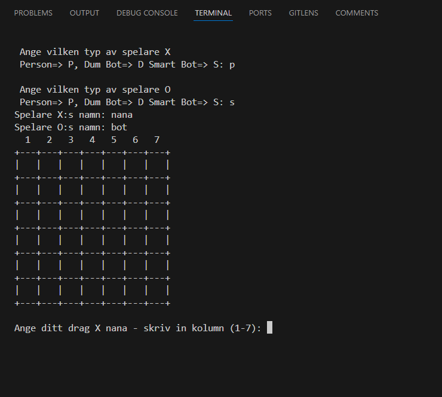
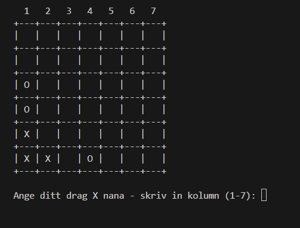

# Connect 4 (4-i-rad) - Terminalspel

## Översikt

Detta är en terminalbaserad implementation av det klassiska Connect 4-spelet, skrivet i TypeScript. Spelet tillåter två spelare att tävla mot varandra eller spela mot en datorstyrd motståndare. Spelet är designat med objektorienterade principer och betonar komposition över arv.





## Funktioner

- Spela mot en annan människa eller en datorstyrd motståndare.
- Välj mellan en "dum" bot och en "smart" bot med olika svårighetsgrader.
- Möjlighet att spela mellan två mänskliga spelare, en människa mot en bot eller två bots.
- Spelet upptäcker vinster och oavgjorda resultat och tillåter omspelning.


## Installation

1. **Kloning av Repositoriet:**

    ```bash
    git clone https://github.com/asom1989/connect4_game-ts.git
    cd connect4-game
    ```

2. **Installera Beroenden:**

    ```bash
    npm install
    ```


3. **Kör Spelet:**

    ```bash
    npm start
    ```

## Användning

När du kör spelet kommer du att bli ombedd att välja vilken typ av spelare som ska delta i spelet:

- **Människa**: Spela mot en annan mänsklig spelare.
- **Dum Bot**: Spela mot en enkel datorstyrd bot som gör slumpmässiga drag.
- **Smart Bot**: Spela mot en mer avancerad datorstyrd bot med förbättrad strategi.

Du kan välja spelartyp för båda spelarna, och spelet kommer att vägleda dig genom att göra drag och visa spelbrädet i terminalen.



